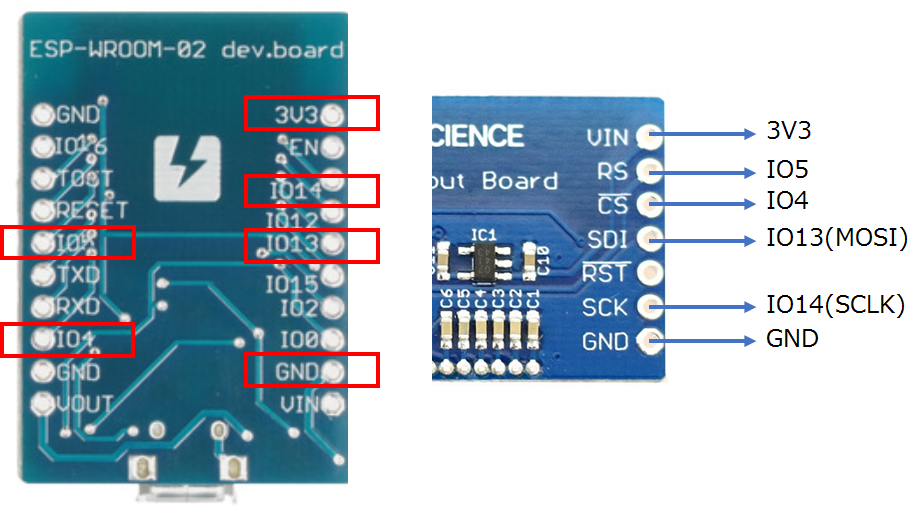

# MicroPythonSushiRotator
Rotate (or slide) a sushi on the LCD panel using [ESP-WROOM-02 (ESP8266) development board](https://www.switch-science.com/catalog/2500/),
[AQM1248A](https://www.switch-science.com/catalog/2608/) and [MicroPython](https://micropython.org/).

## How to play
At first, connect ESP-WROOM-02 and AQM1248A by jumper wires.



Then, put the python script files (data.py and SushiRotator_ESP8266_AQM1248A_SPI.py)
to the ESP-WROOM-02 board.
You can put the files to the board using [adafruit-ampy](https://github.com/adafruit/ampy),
which can be installed by pip.

Notice that the SushiRotator_ESP8266_AQM1248A_SPI.py should be renamed as main.py.

```
C:\temp>ampy -p COM5 put data.py

C:\temp>ampy -p COM5 put SushiRotator_ESP8266_AQM1248A_SPI.py /main.py
```

(Assume that ESP-WROOM-02 board are connected to COM5 on the PC.)

Then, a sushi should be moved from left side to right.
It will work if the micro USB terminal is connected to a battery.

## About Sushi bitmap image
Sushi Emoji is provided free by http://emojione.com.
Using the Sushi SVG file in the Black & White SVG Files, bitmap image is created,
and converted to Python data file.
